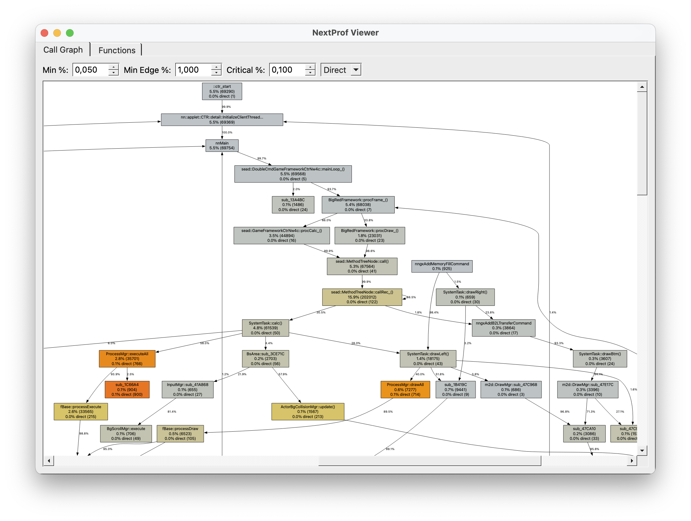
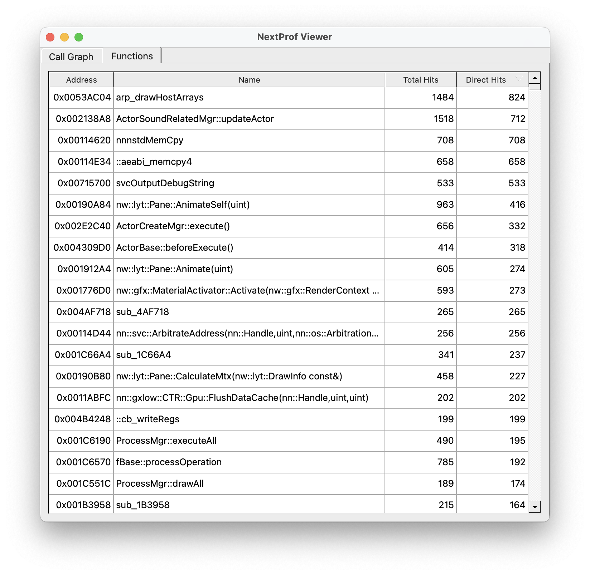

# NextProf

Sampling profiler for the Nintendo 3ds





## Building

Make sure devkitPro (with 3ds buildchain), python3, uv, makerom, ctrtool, bannertool are installed and in `PATH`.

```sh
./build
```

## Configuration

Open `config.ini` to set your desired settings:

### Log
- `File`: if log data should be written to `/nextprof/sys.log` on the SD card.
- `UDP`: if log data should be written to console and `./log` on the host pc via UDP.

### Record
- `File`: if profiling data should be written to `/nextprof` on the SD card.
- `TCP`: if profiling data should be written to `./profile` on the host pc via TCP.
- `Threaded`: if writes to file/TCP should be done in a separate thread. May skew results as other running threads/services may be impacted.

Best only enable the recording target you need, as all options increase the time required when profiling data is flushed.

### Profile
- `InstructionInterval`: after how many executed instructions a profiling sample should be taken
- `StackSize`: maximum stack depth to be dumped for each sample. Rounded down to the next multiple of 4.
- `MaxThreads`: maximum number of threds to record per sample. 0 for all active.

## Capturing profile data

Run the following:

```sh
./serve -qr
```

If not already done, install the two CIAs (app and sysmodule) by scanning the shown QR codes.

If you create the `luma/titles/00040130091A8C02/` folder on the SD card and enable gam patching as well as FIRM/module patching, the profiler sysmodule will be downloaded each time before startup, allowing frictionless development.

The first time you start the profiler app you will be prompted to enter the host. If you want to reconfigure that setting, hold `SELECT` while the profiler app starts.

The profiler app then prompts if the profiler should be started. If confirmed, the app will exit. The next application being launcher will be profiled.

## Analyzing profile data

To view captured call graphs, you need to install `Graphviz`.

### Sample usage:

```sh
cd viewer
uv run ./main.py -c path/to/code.bin  -s path/to/code.map -f ../profile/date_time.bin
```

A symbol map (`-s`) exported from IDA is strictly required currently as that is used to determine what a function a given address belongs to.

A code binary (`-c`) is optional, but is highly recommended, as that is used to remove invalid return addresses from dumped stack data.
